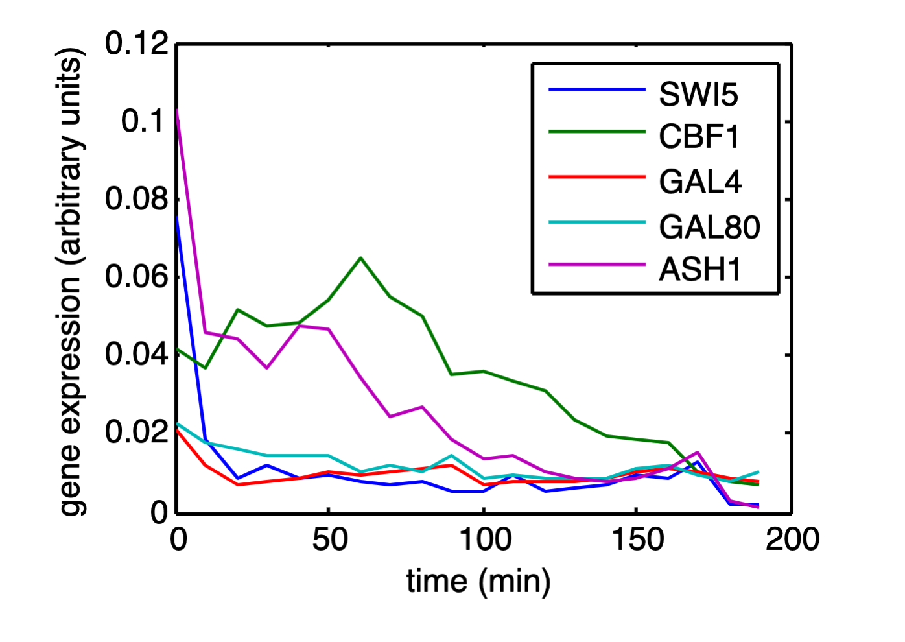
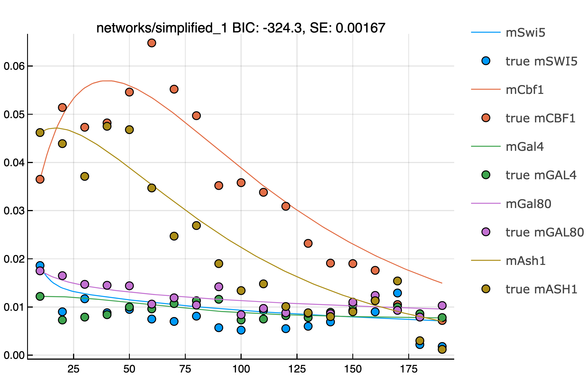
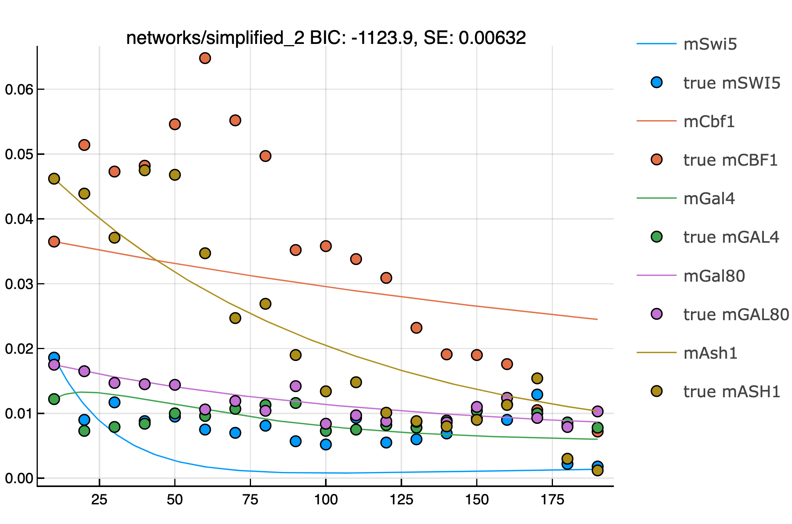
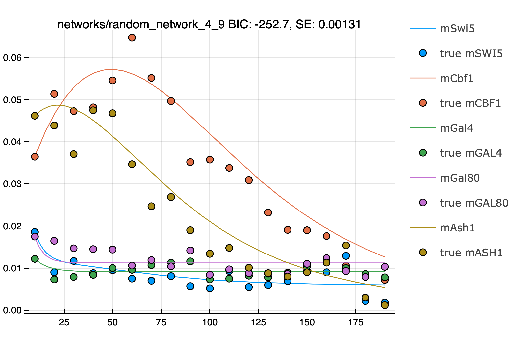

# Simple Gene Regulatory Network Inference Tool with Julia

# How To Run?
```
git clone https://github.com/lutrarutra/GRNInference.jl
cd GRNInference.jl
# 'n' number of threads (int)
julia --threads n --project=. src/main.jl
```

Problem Introduction and Motivation
===================================

The aim of this project is to determine [grn]{acronym-label="grn"
acronym-form="singular+short"} structure from observed data with
computational methods. The [grn]{acronym-label="grn"
acronym-form="singular+short"} of interest in this project is from
article published in 2009 by Cantone et al. [@cantone2009yeast].
Determining a [grn]{acronym-label="grn" acronym-form="singular+short"}
of a system is motivated by problems such as prediction of system
behaviour, and understanding which parts of a system interacts which
each other and how. This knowledge can be used in various applications
of a [grn]{acronym-label="grn" acronym-form="singular+short"} including
drug design, system response prediction to external conditions, and
biological network design.

[grn]{acronym-label="grn" acronym-form="singular+short"}s consist of
species and reactions. Typical species in [grn]{acronym-label="grn"
acronym-form="singular+short"}s are genes and various molecules e.g.
mRNA and proteins. Reactions include interactions between species such
as transcription, translation, and degradation. In this context, species
can be understood as variables with quantities e.g. amount of proteins
while reactions can be understood as functions or equations that modify
these quantities.

It is important to understand that biological networks can be described
with different level of detail. For example, transcription and
translations in nature are complicated processes affected by tens if not
hundreds variables (species). However, sometimes it is sufficient to
simplify these reactions to one reaction between two species e.g.
transcription can be modeled with a constant rate of mRNA production.
The needed level of detail depends on the application of interest.

Data Analysis
=============

Data consists of so called switch-off experiment where five gene
expressions measured at 20 time points every 10 minutes after decreasing
the level of galactose in a system. Here, gene expression data is
assumed to refer to mRNA quantity observed in e.g. RNA-sequencing
experiment.

![Gene Regulatory Network (Cantone et al.
[@cantone2009yeast])](grn.jpeg){#fig:grn}

The true network by original authors is visualised in
figure [1](#fig:grn){reference-type="ref" reference="fig:grn"}. Here,
the lines represent reactions e.g. promotion of a gene, and shapes
represent species. Lines with arrow-heads represent activation or
promotion of a gene by a protein and lines with 'T'-heads represent
suppression or repression of a gene by a protein. In addition to
promotions and repressions, this network contain protein-protein
interaction reaction.

Gene expression data is visualised in
figure [2](#fig:mrna-seq){reference-type="ref"
reference="fig:mrna-seq"}. Gene expression drop drastically at the
beginning of the experiment and stabilises later on. Due to this reason,
I have decided to exclude the first data point and only focus on more
stable interval of gene expression data.

{#fig:mrna-seq}

Network Inference Implementation
================================

Species Modeling
----------------

[grn]{acronym-label="grn" acronym-form="singular+short"} of interest can
be simplified to following species representation: 5 types of proteins,
5 types of genes, 5 types of mRNA. However in addition to these,
additional species are required to model the network; gene
repressed/promoted by a protein forms a secondary type species: complex.
For example, when Swi5-protein binds to Ash1-gene promoter it forms a
complex 'c(gAsh1-Swi5)'. Similarly, protein-protein interactions form
complexes too. In total, the network of interest contains 22 different
types of species (5 genes, 5 mRNAs, 5 proteins, 7 complexes). Only the
species of type mRNA are observed and rest of the species are so called
hidden variables.

Reactions Modeling
------------------

Biological reactions are modeled with mass-action kinetics formulated
with deterministic [ode]{acronym-label="ode"
acronym-form="singular+short"}s. Present reactions in the system are
defined with the following [ode]{acronym-label="ode"
acronym-form="singular+short"}s:
$$\frac{d}{dt}[gene] = -[protein][gene]K_{1} + [complex]K_{2}$$

$$\frac{d}{dt}[mRNA] = [gene]K_{transcription} - [mRNA]*K_{degradation}$$

$$\frac{d}{dt}[protein] = [mRNA]K_{translation}-[protein][species]K_{3} + [complex]K_{4}$$

$$\frac{d}{dt}[complex] = [species1][species2]K_{5} + [complex]K_{6}$$

where, $K_i$ is a parameter e.g. binding affinity between two proteins.

Parameters
----------

It is important to notice the number of parameters (or complexity) each
species adds to the network:

::: {#tab:Parameters}
  Species     Number of parameters                          Parameters
  --------- ---------------------- -----------------------------------
  Gene                           0                                  \-
  mRNA                           2   Degradation & Transcription rates
  Protein                        1                    Translation rate
  Complex                        2             Binding & Release rates

  : [\[tab:Parameters\]]{#tab:Parameters label="tab:Parameters"}
  Parameters of species
:::

Implementation
--------------

Network inference is implemented with Julia programming language
[@Julia-2017] which is well suited for such problem as it has good
availability of tools and libraries for numerical analysis and
computational sciences in addition to it being high performance, dynamic
programming language. Specifically, `DifferentialEquations.jl`-library
[@rackauckas2017differentialequations] was used to solve
[ode]{acronym-label="ode" acronym-form="singular+short"}s of reaction
describing the network.

I have written a library to conveniently define any simple
[grn]{acronym-label="grn" acronym-form="singular+short"} and automatical
formulation of [ode]{acronym-label="ode" acronym-form="singular+short"}s
defining the system. The source code is available on my Github:
[github.com/lutrarutra/GRNInference.jl](https://github.com/lutrarutra/GRNInference.jl).

Experiments
===========

Candidate Network Models
------------------------

Due to the restrictions of computational resources and time, I have
limited the number of experiments to rather small amount of candidate
networks. However, due to the scoring of networks being trivially
parallelisable task it is straight forward to scale my approach to
larger set of of candidate networks or take another more sophisticated
approach such as hill-climbing algorithm to test various network
structures. Selected candidate networks are summarised below:

-   simplified true network where each gene transcribes corresponding
    mRNA molecule (constitutive gene) and mRNA translates corresponding
    protein. Complexes exist only to interact with each other and no
    promotion is required for transcription.

-   another simplified network, similar to the first one except
    promotion of a gene by protein is required for transcription.

-   3 networks with 2 random interactions between proteins and genes

-   3 networks with 3 random interactions between proteins and genes

-   3 networks with 4 random interactions between proteins and genes

-   3 networks with 5 random interactions between proteins and genes

-   3 networks with 6 random interactions between proteins and genes

-   3 networks with 7 random interactions between proteins and genes

-   3 networks with 8 random interactions between proteins and genes

-   3 networks with 9 random interactions between proteins and genes

-   3 networks with 10 random interactions between proteins and genes

Parameter Optimisation and Scoring
----------------------------------

Parameters are optimised with 200 iterations of gradient descent.
Gradients of parameters were calculated with local sensitivity analysis
[@rackauckas2020universal]. Global optimisation is achieved by starting
the gradient descent with 12 different initial parameter configurations
sampled from uniform distribution \[0,0.1\]. Squared error of the true
observed species and modeled observed species is used as the loss
function.

It is clear that the more complex model is, the better fit can be
achieved with respect to the training data. Therefore, networks with
most interaction are guaranteed to have smaller loss than those with
less interactions. This is often referred to as over-fitting. In order
to compare models with different amount of parameters and address
over-fitting, [bic]{acronym-label="bic" acronym-form="singular+short"}
is used to score models:

$$BIC = ln(\hat{L}) - 0.5M*ln(N)$$

where $\hat{L}$ log-likelihood of the loss, M is number of parameters,
and N is the number of data points (19). I.e. model is 'rewarded' for
small loss and 'punished' for high amount of parameters. For
log-likelihood, 10% of the mean observed values was used as noise
magnitude ($\approx 0.015$).

Results
=======

Results are summarised in Table [2](#tab:Results){reference-type="ref"
reference="tab:Results"}. Surprisingly, the results for the two
simplified versions of the true model perform quite differently. True
model (1) (Figure [3](#fig:plot1){reference-type="ref"
reference="fig:plot1"}) has low squared error and high BIC while true
model (2) (Figure [4](#fig:plot2){reference-type="ref"
reference="fig:plot2"}) performs poorly. It seems that true model (2)
suffers from low amount of mRNA molecules. Perhaps, this could be
explained by assumption that mRNA is transcribed only when gene is
promoted. The current implementation does not allow for two
transcriptors for a single mRNA-species and for this reason such
assumption was made.

Random model (9) (Figure [5](#fig:plot3){reference-type="ref"
reference="fig:plot3"}) was the best performing model out of all models.
This model consists of 4 interactions; 3 promotions: gCbf1-Cbf1,
gSwi5-Cbf1, and gAsh1-Ash1; as well as one protein-protein interaction
Cbf1-Ash1. None of these reactions were in the true model as is, however
they can explain the superior performance of this model: protein-Ash1
repressing gene-Cbf1 is computationally similar as protein-protein
regulation of Cbf1-Ash1; in both cases, mRNA-Gal4 translation decreases.
Furthermore, self promoting gCbf1-Cbf1 and gASh1-Ash1 have minimal
effect on other species.

It is important to note that gradient descent can effectively 'turn off'
interaction of two species by optimising their binding constant to 0.
Perhaps, this could be improved by limiting binding constant to some
minimal value \> 0. Perhaps in nature, this would correspond to
leakiness.

{#fig:plot1}

{#fig:plot2}

{#fig:plot3}

::: {#tab:Results}
  Model                         Number of species   Number of parameters   Squared error       BIC
  --------------------------- ------------------- ---------------------- --------------- ---------
  True Model Simplified (1)                    22                     29         0.00167    -324.3
  True Model Simplified (2)                    22                     29         0.00632   -1123.9
  Random model (1)                             17                     19         0.01925   -3330.2
  Random model (2)                             17                     19         0.00473    -835.5
  Random model (3)                             17                     19         0.01859   -3217.0
  Random model (4)                             18                     21         0.00665   -1167.8
  Random model (5)                             18                     21         0.00654   -1149.7
  Random model (6)                             18                     21         0.01657   -2871.9
  Random model (7)                             19                     23         0.00131    -252.7
  Random model (8)                             19                     23         0.00541    -957.1
  Random model (9)                             19                     23         0.01411   -2452.9
  Random model (10)                            20                     25         0.00628   -1109.6
  Random model (11)                            20                     25         0.00625   -1105.6
  Random model (12)                            20                     25         0.01497   -2603.1
  Random model (13)                            21                     27         0.00675   -1194.4
  Random model (14)                            21                     27         0.00628   -1114.0
  Random model (15)                            21                     27         0.01139   -1990.7
  Random model (16)                            22                     29         0.00631   -1121.3
  Random model (17)                            22                     29         0.00193    -368.8
  Random model (18)                            22                     29         0.01051   -1843.6
  Random model (19)                            23                     31          0.0013    -262.7
  Random model (20)                            23                     31         0.00616   -1097.9
  Random model (21)                            23                     31         0.00125    -254.9
  Random model (22)                            24                     33         0.00647   -1154.7
  Random model (23)                            24                     33         0.00181    -353.5
  Random model (24)                            24                     33         0.01367   -2392.0
  Random model (25)                            25                     35         0.00125    -260.9
  Random model (26)                            25                     35         0.00191    -374.6
  Random model (27)                            25                     35         0.00186    -364.9

  : [\[tab:Results\]]{#tab:Results label="tab:Results"} Results of 29
  models
:::
